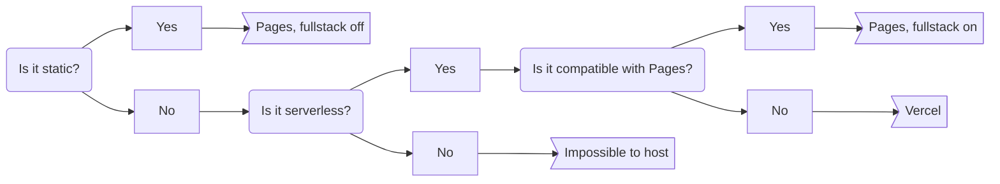

<h1>Jack W.</h1>

technologies

*by the way, these icons were generated with [moller-icons](https://github.com/Jack5079/moller-icons)*

## for websites

I don't use TypeScript because JSDoc exists

### deploying flowchart

## for lego game

I use TypeScript here because there is no roblox-js

## no longer using

- jQuery: projects I made fucking around with Wick Editor
- Node.js: I don't pay for hosting

## tech i haven't used in projects yet

- V: Just learned it and its tooling sucks
- Bash, PowerShell: I use them as terminals, not as scripting languages
- Zig: Not sure how I'll do memory management

## should learn

- GTK/Qt: for desktop apps
- React/Vue: bigger ecosystems than Svelte (I use Roact in roblox-ts, which is sort of like React)

- Also ActivityPub: for making fediverse stuff (my icons generator doesn't have the icon yet which is why it isn't listed above)

i need to learn more compiled languages too

- C#: if i ever have to deal with Windows again
- C++: when i need to fix a bug in kde
- C: i think it's important
- Go/Nim/Zig: to replace V since V has bad tooling

