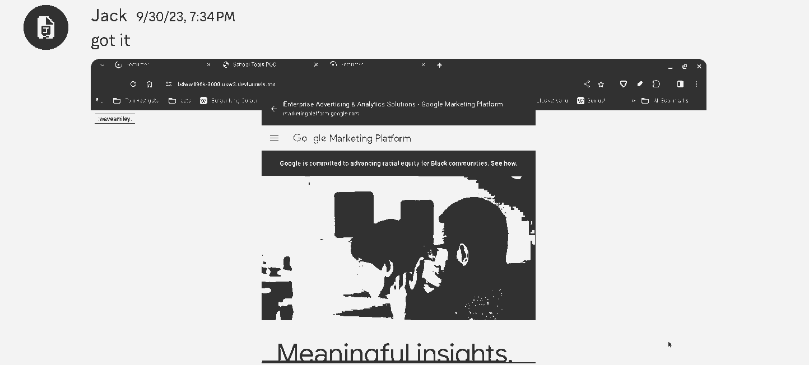
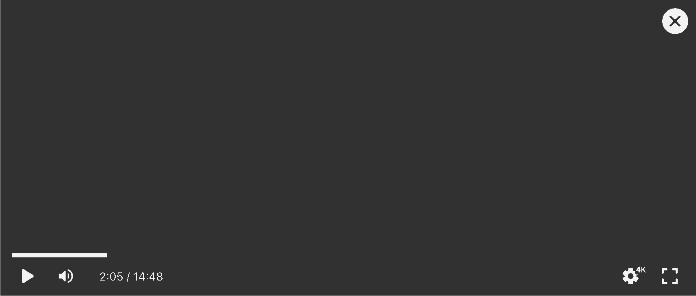
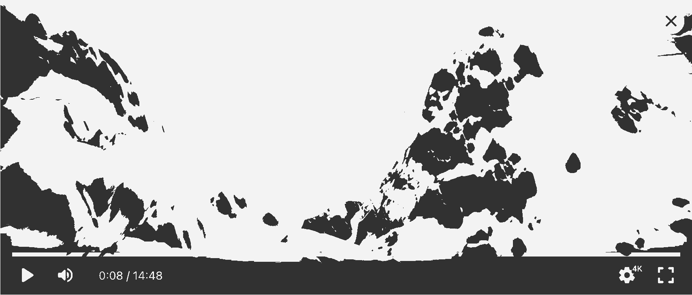

+++
title = "A streamproof webpage*"
description = "*on my exact setup"
date = 2025-07-30
blinding = true
bluesky = "3lva43zrdc225"

[image]
src = "./macbook.png"
alt = "This article open on a MacBook, so bright that almost nothing else is visible besides the address bar and notch"
+++

This entire webpage is drawn in shades of white, where black is #FFF. Even that gray timestamp above this paragraph.

macOS captures the screen in sRGB, so anything brighter gets clamped down, making this webpage streamproof.

---

## How does it work?

The HDR video from [_Wanna see a whiter white?_](https://kidi.ng/wanna-see-a-whiter-white/) is embedded here.
Even though it's at the bottom of this article, it enables HDR for the entire page.

It only works on Safari. The page says it works on Chrome, but I installed Chrome just to test, and although it did match the `dynamic-range: high` query, the only thing made brighter than #FFF is the video, so on Chrome this page is unreadable.

### A color scheme of whites

Just like that website, I'm using `brightness()` filters.
The background here is `brightness(300%)`.

<!-- In addition, I must put `backdrop-filter: brightness()`, with zero arguments, on each element I make bright. -->

The horizontal rule is a linear gradient from gray to white, then set to 200% brightness, to make it white to super-white.
That gray timestamp is 150%.

Images use an arbitrary two-color palette and get their brightness set to 1000% ~~as a treat~~ because I could see anything darker on my S22 Ultra, which does not support HDR on webpages.

### blur(0.6px)

There was shadow of _Whiter White_'s "White." text visible during screenshare, which I had to solve for this post. Adding a blur of 0.6 px fixed it.
I thought I could get away with less, but in a call with [mau](https://mau.monster), he stopped seeing it at 0.6 px too.

### White-on-white or white-on-white?

I went with white-on-whiter. Here's a comparsion between the two:

Whiter on white

White on whiter

I tried to make the entire page's background whiter, but it didn't work, so I went with the body.

## Why?

So I could write an article about it. I'm not proud of [my first article](/blog/optimize-88x31s)&mdash;it feels almost condescending&mdash;and after I saw 31a05b write [a subpost](https://www.31a05b.net/f/short/note-on-8831.html), I removed it from my homepage, replaced with a "Check back later" placeholder.

I'm a fan of self-demonstrating articles, like how May's [Hyprland vulnerablity writeup](https://split.pet/blog/2024/09/hyprland-vulnerability) has a demo at the end, and I've always wanted to write one of my own.

After a bit of web browsing, I found myself on [WebKit's HDR demo page](https://webkit.org/blog-files/color-gamut/), saw the words "out of sRGB",
remembered how [my Monkeytype](https://monkeytype.com/profile/jack5079) screenshots don't have the same colors as the website, thought of _Whiter White_, and started writing this article.

## What didn't work

I've tried to make websites that hide themselves before, but this is the only time that I am satisified with the end result.

### Attempt 1: `PaymentRequest#show`, 2023

Did you know Chrome has an API to display your website in a popup, that looks kind of like an alert(), does not show up in history, and where no extensions can run?

It's called [PaymentRequest#show](https://developer.mozilla.org/en-US/docs/Web/API/PaymentRequest/show).

When I caught this function on while browsing MDN, I got an idea: this could be used to bypass the filter on my school Chromebook!
I confirmed that extensions do not run inside the popup, jotted down some ideas for an interface, then forgot about it.

Four months later, one of my friends tells me he's making a bypass service, so we get to work.

The first thing I did was check if the popup showed when [capturing the tab](https://developer.mozilla.org/en-US/docs/Mozilla/Add-ons/WebExtensions/API/tabs/captureTab), and it didn't since it was outside the page.
The second thing I did was visiting Google's ad servers inside the popup,
which were blocked by my school but would not look suspicious if logged.

That was probably the happiest I've ever been seeing a Google landing page.

After that, I ignored everything I wrote,
made a (terrible) landing page with a search bar,
then a new proof of concept where
the background page scrolls through paragraphs
and navigates through fake pages with [`history.pushState`](https://developer.mozilla.org/en-US/docs/Web/API/History/pushState), so that a teacher might (wouldn't) believe
you are doing work.

When I posted the video to his #announcements channel, my friend replied that our service "will be the first to use this method",
which stroked my ego enough to start calling a Web API a "method" myself. (It's not a method!)

Eventually I got a DM from [proudparrot2](https://proudparrot2.com/) asking me if I was using PaymentRequest. He told me that someone else had discovered the API as well, and had released the code in a popular bypassing community.

After that I lost interest in the project because I knew the API would stop working when the developers of web filters wake up, that I do not want to make software for this audience, and that I had no use for it myself.

### Attempt 2: Widevine, 2025

A couple months ago, I was brainstorming with [May](https://split.pet) about an app I still haven't made when I got off-topic and realized I might be able to use video DRM to create a streamproof webpage:

1. Find a Widevine video and play it
2. Set its brightness really high with a filter because there's no way I'll be able to make my own Widevine videos
3. The video is all white on a real screen, and all black in screen capture
4. Find a clever use of mix-blend-mode to hide the whole page using it
5. Make the video `inert` so you can interact with the content

Finding a video was hard, so I didn't even try to embed it on my own webpage.
Eventually I found the [Shaka Player demos](https://shaka-project.github.io/shaka-player/demo/), and sure enough, the video is all black in OBS.

It was a good idea to not waste effort embedding the video, because adding `filter`, `mix-blend-mode`, or even putting
a div with `backdrop-filter`/`mix-blend-mode` over the video disables screen capture protection, so this was a dead end.

Maybe that's useful for piracy? It wasn't useful for me. ¯\\\_(ツ)\_/¯

---

## Conclusion

I wrote two conclusions and they both sucked. I feel like because of the [.cab tombstone](<https://en.wikipedia.org/wiki/Tombstone_(typography)>), I have to have a good conclusion but I give up.
